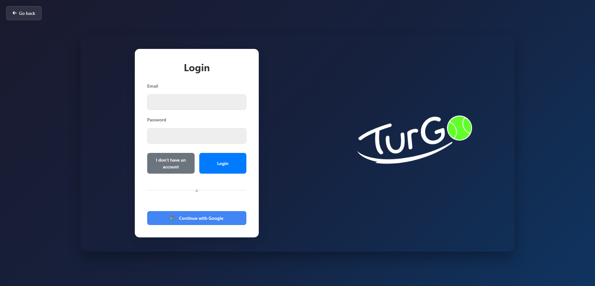
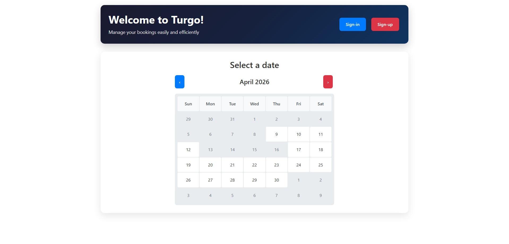
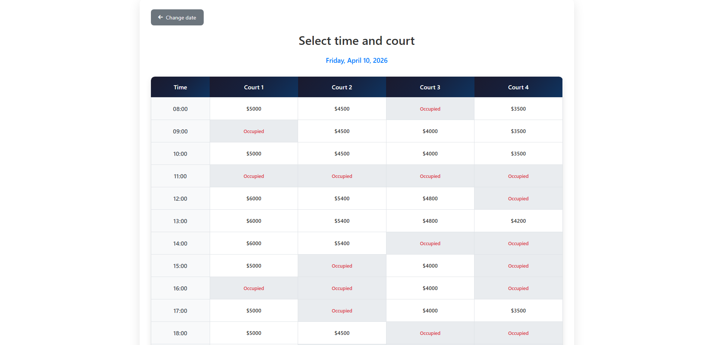
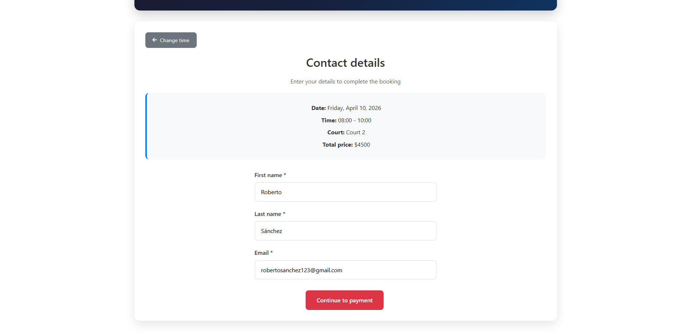
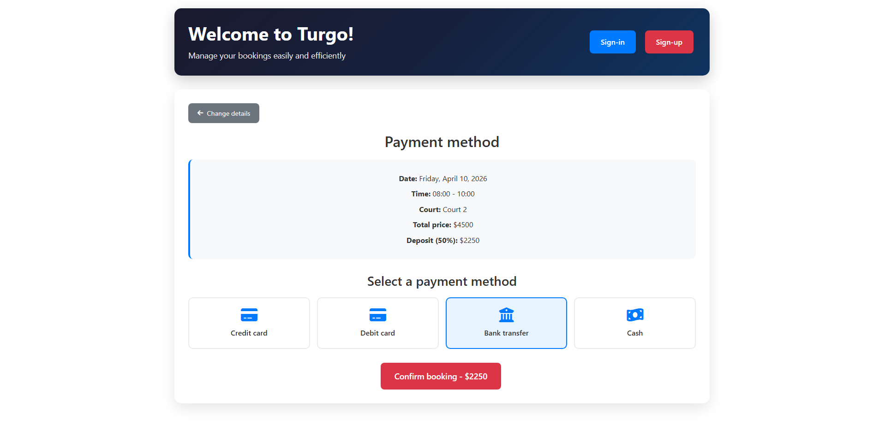
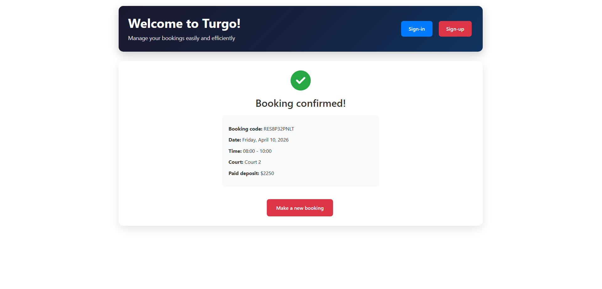

# TurnGo Frontend

Frontend for **TurnGo**, a web app for court booking and schedule management, built with Angular.  
It includes authentication flows (email/password and Google OAuth), availability calendar, and reservation creation.

## Table of Contents
- [Booking Flow](#booking-flow)
- [Overview](#overview)
- [Features](#features)
- [Tech Stack](#tech-stack)
- [Functional Architecture](#functional-architecture)
- [Project Structure](#project-structure)
- [Prerequisites](#prerequisites)
- [Installation](#installation)
- [Environment Configuration](#environment-configuration)
- [Available Scripts](#available-scripts)
- [Run in Development](#run-in-development)
- [Main Booking Flow](#main-booking-flow)
- [Testing](#testing)

## Booking Flow

### Login (optional)


### 1. Select Date


### 2. Choose Court and Time Slot


### 3. Enter Customer Data


### 4. Select Payment Method and Confirm Booking


### 5. Booking Data


## Overview

TurnGo Frontend is a single-page application focused on booking sports courts through a guided multi-step process.  
The app supports both guest bookings and authenticated user bookings, and integrates with separate backend services for booking and user authentication.
Backend Repository: https://github.com/andres-gomezf/turn-go

## Features

- Court reservation by date, court, and time slot.
- Dynamic monthly calendar with real-time availability checks.
- Multi-step booking flow:
  - Date selection
  - Court/time slot selection
  - Customer data entry (for unauthenticated users)
  - Payment method selection
  - Reservation confirmation
- Email/password login.
- User registration.
- Google OAuth login + callback handling.
- Session persistence via `localStorage` (`token`, `refreshToken`, `userEmail`).
- REST API integrations for users, customers, schedules, courts, and bookings.

## Tech Stack

- **Angular 19**
- **TypeScript**
- **RxJS**
- **Angular Router**
- **Angular Forms**
- **Bootstrap 5**
- **Bootstrap Icons**
- **Karma + Jasmine** for unit testing

## Functional Architecture

### Main Routes

- `/turnos` → booking screen
- `/login` → login screen
- `/register` → registration screen
- `/auth/callback` → Google OAuth callback screen

### Core Services

- `TurnoService` → booking CRUD + available slots
- `HorariosService` → time slot/schedule retrieval
- `CanchaService` → court data
- `ClienteService` → customer lookup/creation
- `UsuarioService` → login/register/current user endpoints
- `GoogleAuthService` → Google OAuth start + callback processing

## Project Structure

```text
src/
  app/
    components/
      auth/
        login/
        register/
        google-callback/
      turnos/
    interfaces/
    services/
  assets/
  main.ts
```

## Prerequisites

- **Node.js** 18+ (LTS recommended)
- **npm** 9+
- **Angular CLI** 19 (optional globally)
- Running backend services:
  - **Booking API** (bookings/customers/schedules/courts)
  - **Users/Auth API** (login/register/me/info/google oauth)

## Installation

```bash
# 1) Clone repository
git clone <REPOSITORY_URL>
cd turn-go-frontend

# 2) Install dependencies
npm install
```

## Environment Configuration

> Recommended: move hardcoded URLs to Angular environment files (`environment.ts` and `environment.prod.ts`).

Suggested setup:

```ts
export const environment = {
  production: false,
  bookingApiBaseUrl: 'http://localhost:8080/api/v1',
  usersApiBaseUrl: 'http://localhost:3001'
};
```

Then update services to consume these environment variables instead of hardcoded URLs.

### Suggested Environment Variables

- `bookingApiBaseUrl`: base URL for bookings/customers/schedules/courts API
- `usersApiBaseUrl`: base URL for users/auth API

## Available Scripts

```bash
npm run start   # ng serve
npm run build   # ng build
npm run watch   # ng build --watch --configuration development
npm run test    # ng test
```

## Run in Development

```bash
npm run start
```

Open:

- `http://localhost:4200`

## Main Booking Flow

1. User opens `/turnos`.
2. App generates the monthly calendar and checks date availability.
3. User selects a date, then an available court/time slot.
4. If user is not authenticated, customer data is requested.
5. User selects a payment method.
6. App creates or reuses customer data and creates the booking.
7. A reservation code is displayed as confirmation.

## Testing

```bash
npm run test
```

- Test framework: **Karma + Jasmine**
- Test files: `*.spec.ts` for components and services

